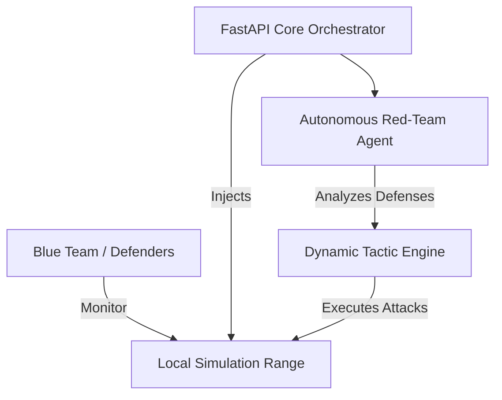

<div align="center">
  <h1>🛡️ Local Cyber Range</h1>
  <p><b>Next-Generation AI-Driven Threat Simulation Environment</b></p>

  
  
  
  
</div>

<br>

---

## ⚡ Executive Summary

**Local Cyber Range** is an advanced, fully localized threat simulation engine designed for modern red teams and security engineers. 

Traditional cyber ranges are cost-prohibitive, heavily reliant on external cloud environments, and utilize static, easily predictable threat models. This project solves this by integrating **autonomous AI agents directly into the simulation engine**. The adversaries in this cyber range actively learn, pivot, and adapt to your defensive maneuvers in real-time.

## 🏗️ Architecture Overview

Built on a lightning-fast **FastAPI** backend, the range allows security engineers to deploy autonomous attackers locally without exposing their tactics or network traffic to external APIs.



## ✨ Core Capabilities

*   **Dynamic Adversaries:** The AI "attackers" adapt to your specific defenses in real time, abandoning blocked paths and discovering new vulnerabilities.
*   **Zero Cloud Dependency:** Run your most sensitive wargame simulations completely offline to ensure maximum operational security.
*   **Highly Extensible:** The modular agent framework allows you to easily inject custom attack vectors, malware samples, and network topologies.
*   **Production-Ready:** Engineered with Python 3.10+, complete with CI/CD pipelines and a comprehensive test suite.

---

## 🚀 Quick Start Guide

### Prerequisites
*   Python 3.10 or higher
*   A localized network environment (VM or isolated docker network recommended).

### 1. Installation

Clone the repository and install the required dependencies instantly using the built-in Makefile:
```bash
git clone https://github.com/lakshanmuruganandam/local-cyber-range.git
cd local-cyber-range

# Installs all required dependencies (FastAPI, Uvicorn, Pytest)
make install
```

### 2. Boot the Range

Launch the simulation engine and the API orchestrator:
```bash
make run
```
The control dashboard and API will be available at `http://127.0.0.1:8000`. You can interact with the auto-generated Swagger UI documentation at `http://127.0.0.1:8000/docs`.

### 3. Run the Test Suite

Before deploying in a simulated environment, ensure the core logic is fully operational:
```bash
make test
```

---

## 📖 API Reference

### Range Health Check
Verify the core orchestrator is active.
*   **URL:** `/health`
*   **Method:** `GET`
*   **Response:**
    ```json
    {
      "status": "ok",
      "message": "Engine is running flawlessly on edge."
    }
    ```

### Inject AI Adversary
Trigger the autonomous agent to begin analyzing the simulated network topology.
*   **URL:** `/api/v1/execute`
*   **Method:** `POST`
*   **Body:** `{"task": "Begin reconnaissance phase on simulated subnet"}`

---

## 🤝 Contributing

We welcome contributions from security engineers and AI researchers! Please follow our strict CI guidelines:
1. Fork the repository.
2. Create your feature branch (`git checkout -b feature/NewAttackVector`).
3. Ensure all tests pass (`make test`).
4. Commit your changes (`git commit -m 'feat: add NewAttackVector'`).
5. Push to the branch (`git push origin feature/NewAttackVector`).
6. Open a Pull Request.

## 📝 License

Distributed under the MIT License. See `LICENSE` for more information.
